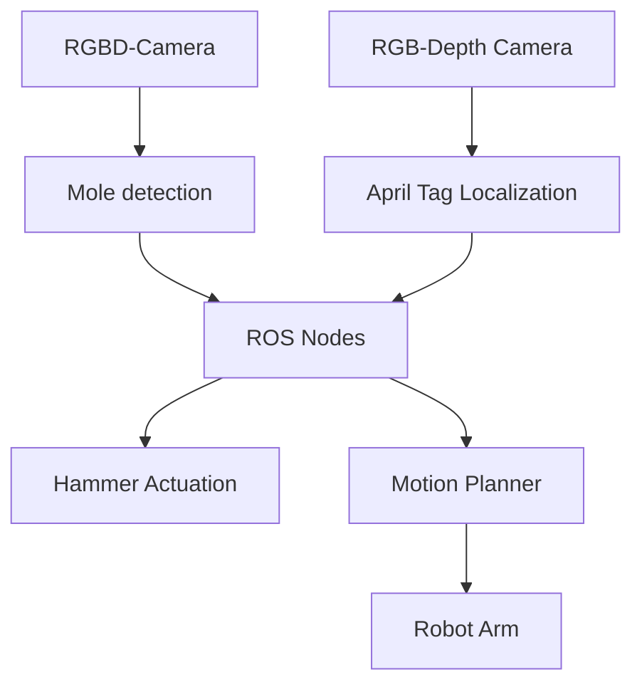

**7-degree-of-freedom robotic arm playing Whack-a-Mole using image processing within the ROS2 ecosystem.**

<video autoplay controls src="{{ site.baseurl }}/assets/posts/Whack-A-Mole/whack_thumbnail.mp4" width="80%"></video>

The goal of this project was to develop a 7-degree-of-freedom robotic arm capable of playing the popular arcade game Whack-a-Mole, using computer vision within the ROS2 ecosystem.

### The Setup

* **Franka Robotics's Emika Panda** - The 7 degree of freedom robotic arm.
* **An AprilTag** -  Attached to the robot’s base for accurate localization within the environment.
* **Realsense D435i Camera**: An RGB-Depth camera ,Used for identifying the moles and getting the sptial coordiantes.
* **Servo Motor-Controlled Hammer** - Executes the hitting action in the Whack-a-Mole game using an Arduino Nano.
* **Whack-a-Mole Game Board** - A custom-built , robust game board. The game loop is handled by an Arduino Uno.

### Block Diagram

### This Post is under construction 🛠️
Building a perfect portfolio from the ground up is a demanding process.
Over the coming weeks, I will be adding more information about my personal and professional projects. 
